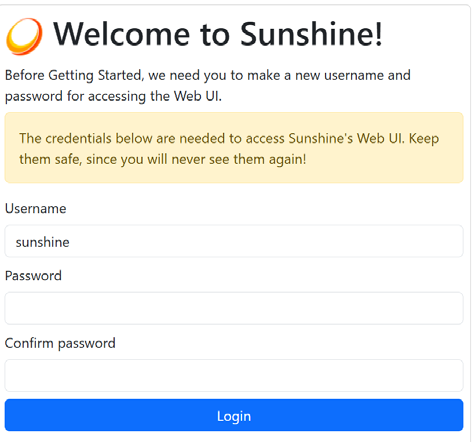
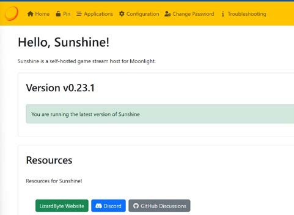

# Using Moonlight Game Streaming from an AtGames Device

These directions permit the user to run PC based
content on the AtGames machine over a network. There is a Quick Start for
experienced users and Detailed Instructions for others. This is possible
using a non-Windows machine, but these instructions assume Windows. This
release is beta/experimental and it should be expected there will
be glitches.

## Why do I want this?

This will allow you to create a network interface between a PC and the
AtGames machine so you can run applications on the PC and control/view
them on the machine. This allows the machine to run applications that
exceed its internal processing power. Examples (not an exhaustive list)
might include: Steam, EpicGames, Amazon Games, GOG, or stand-alone
apps/games.

## Quick Start

1. Install Sunshine/Apollo on PC.
2. Edit the `moonlight.conf` on the USB drive with your PC
IP address.
3. Run Moonlight on the AtGames device.
4. Pair the PC by entering the PIN from Moonlight into the Sunshine web
browser interface (https://localhost:47990).

## Detailed Instructions

1. On the PC you will be using for the integration, go to the Sunshine GitHub releases page:
https://github.com/LizardByte/Sunshine/releases . Pick a release (e.g. latest stable version),
expand the Assets list and download the `sunshine-windows-installer.exe`.

   Alternatively, you can install Apollo, which is a Sunshine fork
and offers many QoL improvements:
https://github.com/ClassicOldSong/Apollo
This guide assumes Sunshine but should work for Apollo as well.

2. Run the Sunshine installer on the PC (ensure that the "run on startup"
switch is selected during install--it should be by default).

3. On the PC you will be using, go to the Windows Search Bar and type `cmd`.

   a. This will open a command prompt window where you will type `ipconfig`.

   b. Document the IPv4 address of the network port that is being used
      to connect to the same network your AtGames device is on. It will look
      something like this: `192.168.0.183`.

4. With your USB drive in your PC, navigate to the
   folder containing the file `moonlight.conf`, and open `moponlight.conf` in a text editor.

   a. Find the line: `#address = 1.2.3.4` and edit to read: `address = 192.168.0.183` (remove the `#` at the front and sub your PC IP address).

   b. Save the file with the edits you have made.

5. Take your USB drive to the AtGames machine and run the UCE
   as normal. 

      - Press `Pair`
      - Document the PIN provided.

6. On the PC, in your web browser, enter `https://localhost:47990`.

    a. Note that you will see security warnings. You will need to
  accept/bypass these as the installer uses a self-signed security
  certificate.
  
    b. On first run, you will establish your own password for the instance. DO NOT LOSE THIS.
  Enter and verify the User and Pass of your choosing and click Login. 

    c. The page will reload as below (note version number may be different). 

    d. Click on PIN in the top menu bar and enter the PIN from the machine.

    The machine and PC are now paired and you should not need to take these
pairing steps again.

7. On the machine, joy down and select Update to see
   available apps from the PC and launch them.

## Making additional applications available

Additional applications that the user may wish to run on the PC and
view/control from the machine can be added by telling the
Sunshine service where the executable for the application is located on the
PC.

1. On the PC, in the Sunshine web interface, click on Applications in the top menu.
2. Click "Add New"
3. As a minimum, 2 fields must be completed.

    a. Application Name -- how the user desires the application to be shown on
  the machine -- e.g. "EpicGames"

    b. Command -- the path to the application's executable on the PC, e.g. `G:\EpicGames\Launcher\Portal\Binaries\Win32\EpicGamesLauncher.exe`.

4. After adding apps in the Sunshine service, you will need to run the
   Update command in the Moonlight menu again to see them.

## Random pointers & troubleshooting

1. For support/feedback, find the "Moonlight" group of channels on
  the Discord server.

2. When using an application on the machine, to toggle between
  mouse emulation mode and controller, hold P1 Start.

    a. When in mouse emulation mode A is L click and B is R click.
  Trackball moves the mouse pointer.

    b. Unfortunately, at the moment, there is no way to display when mouse
  emulation mode is active and it can be a little confusing which
  mode you are in so some patience is necessary.

3. If there are no apps showing on the machine after refreshing, check the
   PC to be sure the Sunshine service is running.

     a. In the Windows search bar, type Services.msc.

     b. Scroll down to SunshineService.
         If it is not running, Start it.
         If it is running, restart it to try to correct the issue.

4. Exiting the game normally should drop you back to the Moonlight interface.
To force exit the streaming session, press R1+SELECT+START(Z+REWIND+P1 START).

   *NOTE*: The application
  that was being streamed will remain running on the PC in this case. You can select Stop in
  the Moonlight menuu to ask the host to close the running game.

