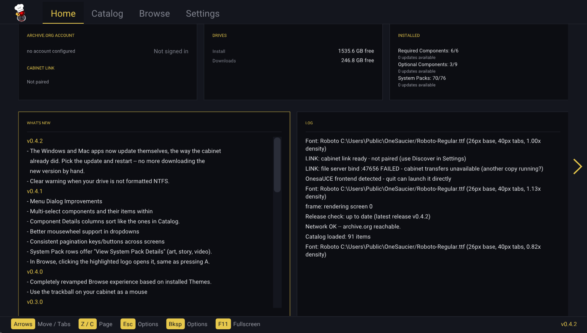
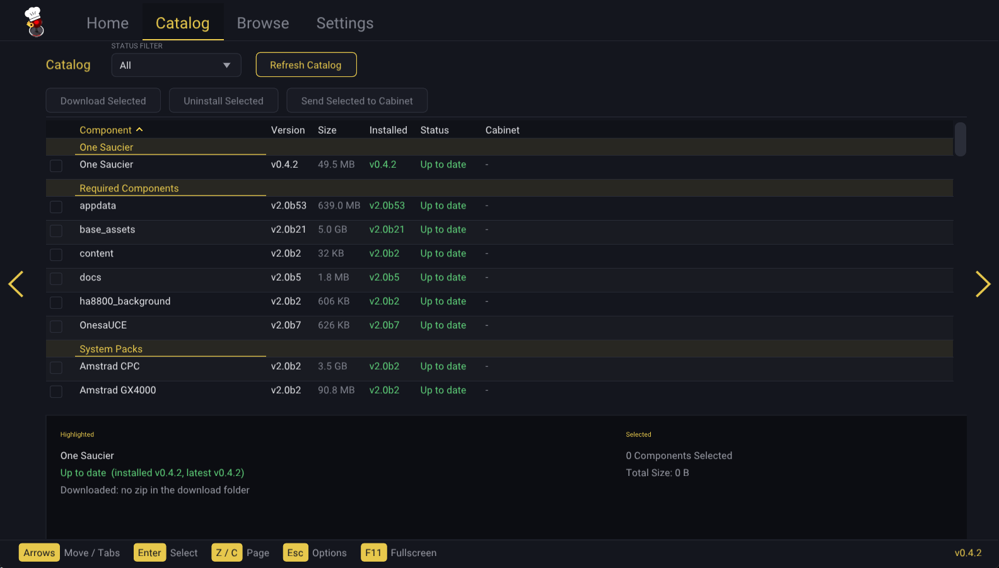
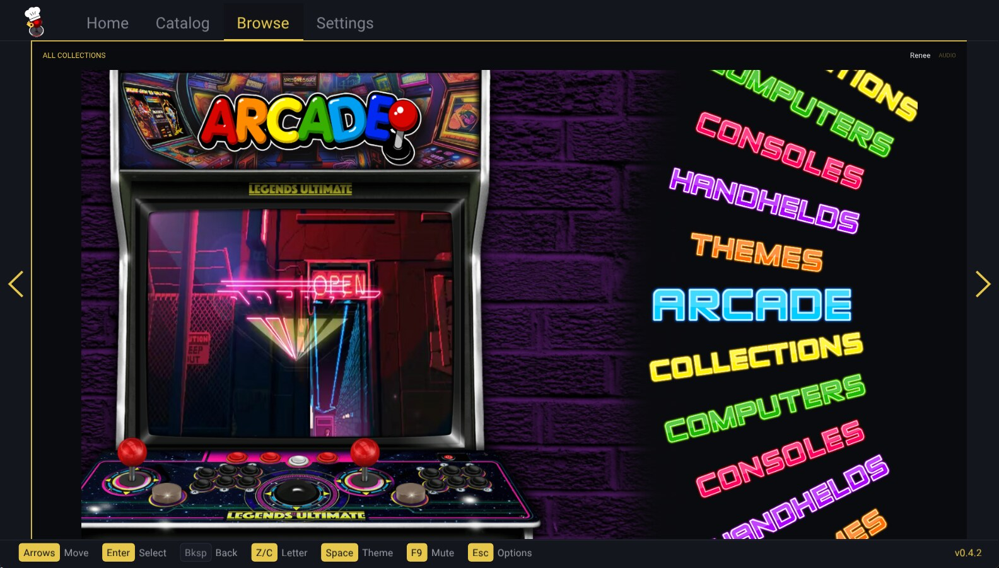
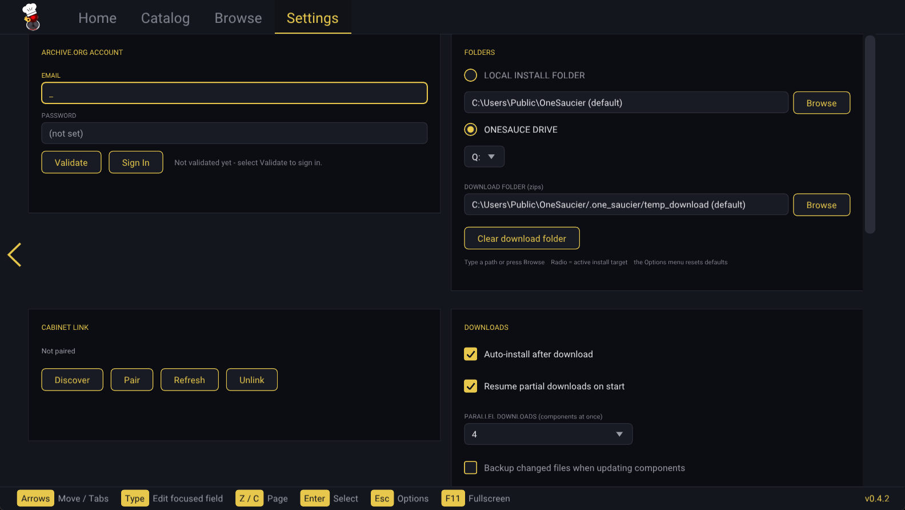

# One Saucier
{: .no_toc }

<p align="center">
  
</p>

## Table of contents
{: .no_toc .text-delta }

- TOC
{:toc}

---

**One Saucier** is a downloader and library manager for **OnesaUCE** content
hosted on Archive.org. It runs **directly on the AtGames Legends Ultimate
cabinet** — no PC required — and installs content onto the same drive it is
running from. Since v0.2.0 it also ships as **Windows and macOS apps** that
manage a local library and can pair with your cabinet over your home network.

This guide covers **v0.4.2**, the current release.

{: .note }
One Saucier is a separate application from the OnesaUCE frontend itself. It
installs, updates, and removes OnesaUCE's components; it does not replace
RetroFE or launch games.

## What it does

- **Browse the whole OnesaUCE catalog** — required components, 75+ system
  packs, video packs, and themes, each with its size, available version, your
  installed version, and a colour-coded status.
- **Install whole components, or single games and videos.** Opening a system
  pack or video collection lists its individual titles; install them one at a
  time and only the bytes for that title are fetched.
- **Parallel downloads** (up to 8 at once) with pause, resume, and cancel.
  Interrupted downloads survive a reboot and pick up where they stopped.
- **Crash-safe installs** — everything extracts to a staging area and is moved
  into place only when complete, so a power cut can never leave a component
  half-written.
- **Browse your installed library inside a real OnesaUCE theme** — the Browse
  tab renders your collections with the same engine the cabinet uses,
  animations, music, and game videos included.
- **Uninstall** packs, videos, and themes; files shared with other installed
  components are kept automatically.
- **Pair a PC or Mac with the cabinet** and send content to it over your home
  network, down to a single game.
- **Edit OnesaUCE's own settings** from the Settings screen.
- **Self-updating** — One Saucier appears as the first row in its own catalog
  and updates like any other component.

## Requirements

| | |
|:--|:--|
| **Archive.org account** | Required for all downloads. Create one free at [archive.org](https://archive.org/account/signup), then sign in from the app's Settings screen. |
| **Cabinet** | An AtGames Legends Ultimate running OnesaUCE, and an **NTFS-formatted** USB drive. |
| **Windows** | Any 64-bit Windows PC. The install target drive must be **NTFS** if it is going to be used on the cabinet. |
| **macOS** | macOS 11 (Big Sur) or later. The app is a universal binary — Apple Silicon and Intel both run natively. |

{: .warning }
OnesaUCE and One Saucier will only run from an **NTFS** drive. exFAT and FAT32
drives cannot hold the install, and FAT32 cannot hold the biggest packs at all:
its 4 GB per-file ceiling is smaller than `base_assets`. Since v0.4.2 the app
says so up front — Home shows a **DRIVE FORMAT WARNING** naming the actual
filesystem, and a download whose largest file cannot fit is refused before it
starts, naming the pack and the size, instead of failing partway through a
multi-hour download. If One Saucier is started from an unwritable or non-NTFS
drive on the cabinet, it shows a full-screen explanation and exits cleanly
rather than failing silently.

## Installation

Every release ships one download per platform. Grab them from the
[latest release](https://github.com/ennisj/one_saucier/releases/latest).

### Cabinet (AtGames Legends Ultimate)

1. Download `one_saucier_v0.4.2_cabinet.zip`.
2. Extract it to the **root of your OnesaUCE USB drive**, so that
   `one_saucier.uce` and the `one_saucier/` folder sit side by side at the
   drive root. Replace any older copies — your sign-in and settings are kept.
3. Insert the drive, boot the cabinet, and select **One Saucier** from the
   games menu (**BYOG** section).

{: .note }
After the first install you never need to do this again by hand — the app
updates itself from inside the Catalog. See [Updating One
Saucier](#updating-one-saucier).

### Windows

1. Download `one_saucier_v0.4.2_windows.zip`.
2. Unzip it anywhere and run `one_saucier.exe`. Everything it needs is in the
   folder, and its settings, logs, and downloads stay next to the exe.
3. Point it at the folder or drive that holds (or will hold) your OnesaUCE
   files, or skip straight to pairing with the cabinet.

### macOS

1. Download `one_saucier_v0.4.2_macos.tar.gz` and unpack it.
2. Move `one_saucier.app` wherever you like — **Applications** works — and open
   it. See the first-launch note below.
3. The app keeps its settings, logs, and downloads in
   `~/Library/Application Support/one_saucier`.

Because the app is not signed with a paid Apple certificate, macOS shows a
security warning the **first time** you open it. This is expected and you only
have to get past it once.

**On macOS 15 Sequoia and newer:**

1. Double-click the app. When macOS says it cannot be opened because Apple
   cannot verify it, click **Done** — do *not* click "Move to Trash".
2. Open **Apple menu ▸ System Settings ▸ Privacy & Security**.
3. Scroll to the **Security** section, find the line saying *"one_saucier" was
   blocked*, and click **Open Anyway**.
4. Confirm with Touch ID or your password, then click **Open Anyway** once
   more. The app launches and will not ask again.

**On macOS 11 Big Sur through 14 Sonoma**, the quicker method works instead:
right-click (or Control-click) the app and choose **Open**, then **Open**
again.

{: .warning }
> If you see *"one_saucier is damaged and can't be opened"*, that is the
> download-quarantine flag, not actual damage. Open **Terminal**, paste the
> line below (adjusting the path if the app is not in Applications), press
> Return, then open the app normally:
>
> ```bash
> xattr -dr com.apple.quarantine /Applications/one_saucier.app
> ```

## Signing in

Open **Settings**, select the email field, and enter your Archive.org
credentials — with the on-screen keyboard on the cabinet, or by typing on the
desktop builds. **Validate** checks them against Archive.org and stores them
with the app's settings, so you stay signed in across launches.

On the cabinet, an on-screen keyboard appears:

| Control | Action |
|:--|:--|
|Stick | Move the keyboard cursor |
|`A`{: .label } | Type the highlighted key |
|`P1`{: .label } / `START`{: .label } | Enter — advance from email to password, then submit |
|`X`{: .label } | Shift |
|`B`{: .label } | Space |
|`C`{: .label } | Backspace |
|`REWIND`{: .label } | Back to the email field, then close the keyboard |
|`MENU`{: .label } | Clear email / clear password / cancel sign-in |

`X`{: .label } cycles Shift through three states — **off**, **once** (the next
key only), and **caps** (sticky). Shifted, the number row types `!@#$%^&*()`
and the symbol keys give a second bank of `[ ] { } < > \ | ; ,` and `~ ' "`,
so every printable character except the backtick is typeable.

{: .note }
The desktop builds have no on-screen keyboard — you just type into the fields.

## The four screens

One Saucier has four tabs — **Home**, **Catalog**, **Browse**, and
**Settings**. Push the stick left/right (or use the arrow keys) to move
between them from anywhere on a screen; push up past the top of a screen to
land on the tab strip itself.

### Home



Home is the status page. Its tiles are:

- **ARCHIVE.ORG ACCOUNT** — your email and a right-aligned *Signed in* /
  *Not signed in*, plus a **CABINET LINK** sub-section showing the current
  pairing status (*Linked to …* / *Ready - not linked* / *Disabled*).
- **DRIVES** — free space. On the cabinet this is one **OnesaUCE** row; on
  desktop it is two, **Install** and **Downloads**.
- **INSTALLED** — a count and update tally for **Required Components**,
  **Optional Components** (videos and themes), and **System Packs**. The
  Required header turns red while that group is incomplete. Below a separator
  it appends live rows when there is something to report: **Current Job**
  (*Downloading …* / *Installing …* / *Paused* / *Ready to Install* /
  *Failed*), **Downloads** (a tally such as *2 downloading, 1 installing, 1
  paused … (+3 queued)*), and **App Update**.
- **WHAT'S NEW** — the release notes for every version, right on the cabinet.
- **LOG** — a live view of the session, following the tail until you scroll up.

Rows in every tile highlight and click, and `Z`{: .label } / `C`{: .label }
page through the long ones.

### Catalog



The Catalog is the install screen. Components are grouped, in this order,
under **One Saucier** (the app's own row), **Required Components**, **System
Packs**, **Videos**, and **Themes**.

Columns are **Component**, **Version** (available), **Size**, **Installed**,
and **Status**, behind an unlabelled checkbox column. On Windows and macOS a
sixth **Cabinet** column sits at the far right, showing that component's state
on the paired cabinet in the same words as your local Status — plus
*Transferring* while you are sending it and *Removing* while it is being
uninstalled there. It reads `-` when no cabinet is paired.

Every column header is a control: walk onto it with the stick or arrows (or
click it) and press `A`{: .label } / Enter to sort by that column; press again
to reverse. Components stay inside their groups while sorted, and version
columns sort by real version order, so `b10` comes after `b9`.

The **status** column tracks every state a component can be in:

| Status | Meaning |
|:--|:--|
| **Up to date** | Installed and current |
| **Update Available** | Installed, but a newer version exists |
| **Not installed** | Available to download |
| **Downloading / Installing** | In flight right now |
| **Queued for Download** | Waiting for a parallel-download slot |
| **Paused** | Stopped by you; resumes where it left off |
| **Ready to Install** | Downloaded but not yet installed (kept across restarts) |
| **Removing** | Being uninstalled |
| **Failed** | The last attempt did not complete |
| **Pending Restart** | A One Saucier update is installed; restart to run it |

The **STATUS FILTER** dropdown beside the title narrows the table to **All**
(the default), **Not up-to-date**, any single status from the table above,
or — on a desktop build — **Not on cabinet**, to see only what the cabinet is
missing. A **Refresh Catalog** button sits next to it.

Under the table sits a split card. **Highlighted** describes the focused row:
its progress bar and *Time Remaining* while a job runs, its version line, the
**Component Base** size and whether it is installed, an *N / M games
installed* count, and a *Downloaded:* line telling you what is in your
download folder (*no zip in the download folder*, *complete*, *N% (partial)*,
*older version*, or *larger than the catalog size (stale)*). When focus is on
a header control instead, it describes that control. **Selected** shows *N
Components Selected* and their *Total Size*.

An installed pack that is only partly filled in shows its item count next to
the version, e.g. `v2.0b4 (3/1261)`.

### Component Details

Press `A`{: .label } on a system pack or video pack and choose **View
Individual Components** to drill in. Columns are **Game Name** (or **Video**
in the Videos group), **Download Size**, **Installed**, **On Cabinet**, and
**Status**, behind the same checkbox column as the Catalog. Installed and On
Cabinet read *Yes* or *No*. Since v0.4.1 the headers sort exactly like the
Catalog's, and the same split **Highlighted** / **Selected** card sits below.

Per-item statuses are *Not Installed*, *Up-to-Date*, *Requires Update*,
*Queued*, *Downloading*, *Installing*, *Transferring*, *Removing*, and
*Failed*, and the **STATUS FILTER** dropdown offers **All**, **Not
up-to-date**, **Not on cabinet** (desktop), or any single status.

Pressing `A`{: .label } on an item opens a dialog titled *&lt;component&gt; :
&lt;item&gt;* offering **Download and install** (or **Re-download and
reinstall**, or **Remove from download queue** when it is queued),
**Uninstall**, **Transfer to cabinet**, **Remove from cabinet**, and **View
Game Details** / **View Video Details**.

{: .important }
**The Component Base.** Every collection has shared files — metadata, system
artwork, attract videos — that all of its games need. One Saucier installs
that **Component Base** once, the first time you install anything from the
collection. Every game after that costs only its own few megabytes. The pane
under the table tells you the Component Base's size and whether it is
installed yet.

A few collections cannot be split this way — **ScummVM**, **Daphne**, and
**Emerson Arcadia 2001** keep their game data outside the usual per-game
layout, so they install as whole packs only and Component Details is disabled
for them.

### Browse

{: .new }
Rebuilt in **v0.4.0**. Browse is no longer a list view — it is a full-screen,
live OnesaUCE theme.



The Browse tab renders your installed library inside a real cabinet theme,
drawn by a port of the same RetroFE layout engine OnesaUCE runs: wheels,
per-selection artwork and video, the theme's own authored animations, fonts,
sounds and music, splash intros, and collection drill-down. What you see is
what the cabinet shows.

Across the top sits a breadcrumb of the collection you are in with a row of
depth pips, the running theme's name on the right, and an `AUDIO` / `MUTE`
indicator in the corner. Browse opens on the theme your cabinet is actually
configured to use.

- **Arrows / stick** move through the wheel; a theme's authored wheel
  direction is honoured, so horizontal-wheel themes step with Left/Right and
  vertical ones with Up/Down.
- **Enter / `A`{: .label }** opens the highlighted item — or, since v0.4.1,
  just click the highlighted logo with the mouse or trackball.
- **Backspace / `REWIND`{: .label }** walks back out of a collection.
- **`Z`{: .label } / `C`{: .label }** jump by starting letter.
- **`X`{: .label } on the cabinet, `Space`{: .label } on desktop** opens the
  **theme picker**, which lists every installed theme with its logo, a
  rendered thumbnail of its layout, and a live preview video of the theme
  playing in the thumbnail slot. Choose one to apply it. You can also drill
  into the **THEMES** collection on the wheel and press `A`{: .label } on a
  theme row to switch to it, exactly as the cabinet does.
- **`Y`{: .label } on the cabinet, `F9`{: .label } on desktop** mutes and
  unmutes. The choice sticks across theme changes, tab switches, and detail
  views.

{: .warning }
**Changing the theme here changes what One Saucier shows, not what your
cabinet uses.** The Browse theme is a per-session choice inside the app. To
change the theme the OnesaUCE frontend itself boots into, use **Settings ▸
ONESAUCE ▸ DEFAULT THEME** — that is the only control that writes the theme
into OnesaUCE's `settings.conf`.

Opening a game gives you **Game Details** — its file, collection,
sub-collections, source pack, install status, story text, a tile for every
piece of artwork the drive actually has (front art, logo, screen title,
screenshot, bezel, LED/LCD marquee), and a playable video tile with
play/pause, 2-second skip, mute, and fullscreen. A clip in the **Jukebox**
collection opens as **Video Details** instead, and **View Collection Details**
in the menu describes the collection you are standing in — its artwork, its
story file, and its video when it ships one.

While a details view is open the theme behind it pauses and mutes; closing it
restores both, and the wheel returns exactly where you left it. A video you
open yourself always starts audible at full volume regardless of what the
theme was doing.

#### Theme tags

The picker labels every theme with how its layout is authored:

| Tag | Meaning |
|:--|:--|
| **XML** | The theme ships a `layout.xml` — the normal case |
| **LUA** | The theme ships a `layout.lua` skeleton, from which One Saucier resolves the real XML |
| **ERR** | The theme folder has neither, so it renders an error card |

A theme also shows its version, or *no version* when it ships none. A broken
theme is still listed, still selectable, and still applicable — it is labelled
(*layout error - runs its error card*), never hidden. If a theme unexpectedly
fails to load when you apply it, One Saucier rolls back to the theme you were
using and the collection you were in, rather than leaving you on a half-loaded
screen.

### Settings



Settings is a grid of cards — two per row in the horizontal layout, a single
column in the vertical one — in this order:

**ARCHIVE.ORG ACCOUNT** — `EMAIL` and `PASSWORD` fields (the password is
masked, and reads *(not set)* when empty), a **Validate** button, and a **Sign
In** / **Sign Out** button whose label follows your state.

**FOLDERS** *(desktop only)* — a radio pair choosing where the app installs
and scans: **LOCAL INSTALL FOLDER**, or **ONESAUCE DRIVE**, chosen by letter
from a dropdown of mounted drives. Both stay configured; the radio picks which
one is active. A saved-but-missing letter still lists, as *X: (not present)*.
Below that sits **DOWNLOAD FOLDER (zips)** and a **Clear download folder**
button.

Since v0.4.2 the two path boxes can be **typed into** as well as browsed —
handy for a long path or a network share. Type and press Enter, or walk off the
field and what you typed is kept; **Esc** puts it back. A **Browse** button
beside each box still opens the folder picker. A typed path that is not an
existing folder is refused and the old one restored, with the reason in the
log, and an empty box means "use the default".

Warnings appear live under the drive control and re-check every couple of
seconds:

> *drive not present*
>
> *this drive is exFAT — OnesaUCE and the cabinet require an NTFS-formatted
> drive* / *reformat it as NTFS in Windows (outside One Saucier) before using
> it here*

**CABINET LINK** — on desktop: **Discover**, **Pair** / **Re-pair**,
**Refresh**, and **Unlink**, plus the PIN field while pairing. On the cabinet:
the link status, **Cabinet IP**, **Refresh**, **Disconnect from PC** /
**Connect to PC**, and **Unlink**. See [Cabinet Link](#cabinet-link).

**DOWNLOADS**

| Setting | Default |
|:--|:--|
| Auto-install after download | On |
| Resume partial downloads on start | On |
| Parallel downloads (components at once), 1–8 | 4 |
| Backup changed files when updating components | Off |
| Keep downloads *(desktop only)* | Keep the newest of each component |

**Keep downloads** also offers: keep for 7 / 30 / 90 days, keep the folder
under 5 / 20 / 50 GB, or delete downloads after installing. A download still
in progress is never removed, and **Clear download folder** is refused while
jobs are running.

**SCREEN SAVER** — *Enable screen saver (downloads keep running)*, on by
default, and *Minutes of inactivity before it starts*, default **10**,
adjustable from 1 to 60.

**ORIENTATION** *(called THEME before v0.4.1)* — **Horizontal**, the classic
landscape 1920×1080 layout, or **Vertical**, a 1080×1920 portrait layout for
rotating-monitor and pinball cabinets. On desktop the window reshapes to fit
your screen; in fullscreen and on the cabinet the picture letterboxes unless
the panel is rotated to match.

**ONESAUCE** — edits OnesaUCE's own `settings.conf` directly, in two
sub-sections. *Settings Tweaks* holds the **Legends Pinball Micro rotation
fix**. *OnesaUCE Settings* holds: remember the last highlighted menu entry,
log output from the game launcher, enable video playback, auto-scan
collections on startup, the **default theme** (a dropdown of your installed
layout folders), video loops (0 = continuous), seconds before Attract Mode
(0 = off), seconds between Attract Mode items, and default video volume.

{: .note }
The OnesaUCE rows stay locked until the `appdata` and `base_assets` components
are installed — there is no `settings.conf` to edit before that, and the card
says so. The starting collection is kept on **Main** automatically, which is
the same rule the Companion app applied.

## Installing content

### A whole component

Move onto the row and press `A`{: .label } / Enter. A dialog titled
*&lt;component type&gt; : &lt;component&gt;* confirms the download and, on
desktop with a paired cabinet, offers to send it there. Pick several
components and they queue up: downloads run in parallel (up to your configured
limit) while installs run one at a time in the background.

### A single game or video

Open the pack's **Component Details**, move to the game, and press
`A`{: .label }. Only that title's files — plus the collection's [Component
Base](#component-details) the first time — are range-downloaded from the
archive, checked against their stored size and CRC32, and committed through
the same staged install path as everything else.

Individual downloads queue exactly like component downloads: asking for one
while another is running marks the row **Queued** and it starts when the slot
frees. Queued rows offer *Remove from download queue*, and the menu can clear
a component's whole item queue at once.

### Several at once
{: .d-inline-block }

New in v0.4.1
{: .label .label-green }

Both the Catalog and Component Details have a **checkbox column** on the left.
Push the stick LEFT to enter the checkbox lane, `A`{: .label } to toggle, or
click the box with the mouse or trackball. Checked rows stay marked in blue
until you clear them.

Three pills at the top of the screen act on everything you have checked:
**Download Selected**, **Uninstall Selected**, and **Send Selected to
Cabinet** (desktop only). They stay grey until something is checked. Batches
silently skip rows the action cannot apply to — already-downloaded,
not-installed, One Saucier's own row — and log a done/skipped tally when they
finish. Uninstalls and cabinet transfers drain one at a time. The same three
entries appear in the Menu.

Changing the Status filter clears your marks; re-picking the value already
selected does not.

### Uninstalling

Optional components — system packs, videos, and themes — can be removed from
the Catalog: select the row, open its dialog, pick **Uninstall**, and confirm
(it is a two-step confirmation). Required base components never offer it.

Removal is careful about shared resources. Anything another installed
component also uses, and everything in the collections `_common` pool, is
kept, and when in doubt files are left in place. New installs record a file
manifest so removal is exact; components installed before this feature existed
fall back to their downloaded zip's file list, or to the collection folder for
game packs.

Individual games and videos can be removed the same way from Component
Details, and removal respects other components' claims on the same files.

## Cabinet Link

Cabinet Link pairs a Windows or macOS copy of One Saucier with the copy
running on your cabinet, over your home network, so you can download at your
desk and install from the couch.

**To pair:**

1. Run One Saucier on both machines, on the same network.
2. On the PC, open **Settings ▸ Cabinet Link** and press **Discover**. The PC
   probes the local network — it tries the local broadcast address, the global
   broadcast address, and a direct unicast to any host it already knows, since
   some routers filter broadcast traffic.
3. Press **Pair**. The cabinet raises a full-screen dialog showing your PC's
   name and a large **six-digit PIN**. (It holds the screen saver off while
   the dialog is up, and `REWIND`{: .label } / `B`{: .label } rejects the
   request.)
4. Type the PIN on the PC and press Enter. `Esc`{: .label } cancels.

The PIN is valid for **two minutes** and allows **five** wrong attempts before
the pairing session aborts — a wrong PIN inside that budget just lets you try
again. Once paired, the link is remembered and verified at every startup: the
card says *checking…*, then either confirms the link or reports the cabinet
unreachable.

{: .note }
The cabinet's Settings card also shows its own **Cabinet IP**, with a
**Refresh** button that re-reads it. That is the address to use if discovery
does not find it and you need to pair directly.

**Once linked, the desktop app can:**

- Show each component's install status **on the cabinet**, in the Catalog's
  **Cabinet** column, including live activity: *Transferring* while you are
  sending it, *Installing* while the cabinet installs it, and *Downloading*
  when the cabinet is fetching something on its own.
- **Send a component to the cabinet.** The PC checksums the zip, the cabinet
  downloads it from your PC over the network, verifies it, and installs it
  through its normal pipeline, with progress on both screens.
- **Send a single game or video**, using the same per-item mechanism as a
  local install.
- **Remove a component from the cabinet** (v0.4.1), as a two-step confirmation
  on the Catalog row.
- Filter the Catalog by **Not on cabinet** to see only what is missing there.

**Connect, disconnect, and unlink** are three different things:

| Control | Where | Effect |
|:--|:--|:--|
| **Connect / Disconnect from cabinet** | PC, Home menu | Stops using the link without forgetting it. The status poll idles, cabinet data is cleared so nothing stale is shown, and remote offers hide. Reconnecting re-probes and resumes. |
| **Disconnect from PC / Connect to PC** | Cabinet, Settings | Turns the cabinet's link service off. It stops answering discovery and refuses requests, but keeps the pairing. |
| **Unlink** | Either side, Settings | Forgets the pairing entirely. You will have to pair again with a new PIN. |

{: .note }
One Saucier never transfers **itself** over the link — the cabinet updates its
own copy through its own release flow.

{: .important }
**Capabilities are negotiated.** A cabinet running an older build simply does
not offer the newer actions: per-item transfer and removal need v0.3.0 or
later, and *Uninstall from cabinet* needs v0.4.1. The PC hides what the
cabinet cannot do rather than failing at the point of use.

{: .highlight }
**Firewall / network notes.** The link uses **UDP 47654** for discovery and
**TCP 47655** for control on the cabinet, and **TCP 47656** on your PC, which
serves the zip files the cabinet pulls. If pairing cannot find the cabinet,
check that both machines are on the same subnet and that a firewall, a guest
network, or a router's "AP isolation" / "client isolation" setting is not
blocking traffic between them. The paired PC's routine status polling is
deliberately kept out of the cabinet's log, so it does not pile up as toasts
over the screen saver.

## Controls

### On the cabinet

| Control | Action |
|:--|:--|
|Stick `UP`{: .label } / `DOWN`{: .label } | Move through lists line by line; push up past the top of a screen to reach the tab strip |
|Stick `LEFT`{: .label } / `RIGHT`{: .label } | Move between side-by-side tiles and columns; off the edge of a screen's content, switch tabs. On the tab strip, change tabs |
|`A`{: .label } | Select / confirm / toggle |
|`Z`{: .label } / `C`{: .label } | Page up / page down |
|`MENU`{: .label } | Contextual options for wherever you are |
|`REWIND`{: .label } / `B`{: .label } | Close a dialog, or back out one level |
|Trackball | Move the pointer; `A`{: .label } clicks |

`Z`{: .label } and `C`{: .label } page rather than switch tabs, and what they
page depends on where you are: rows in the Catalog and Component Details, the
focused panel on Home, **card by card** in Settings (new in v0.4.1), the
previous/next game in a details view, and the previous/next **starting letter**
in Browse. Hold them to repeat.

`REWIND`{: .label } and `B`{: .label } are identical and always mean "back":
close an open dropdown, leave a details view, back out of Component Details,
or pop up one level of the Browse tree. On **Home**, where there is nothing to
back out of, the same press opens the **Menu** — that is where the quit
options live since v0.4.1.

{: .note }
`X`{: .label } and `Y`{: .label } do nothing on most screens. On the Browse
wheel they are claimed: `X`{: .label } opens the theme picker and
`Y`{: .label } mutes.

**The trackball** (v0.4.0 onward) is a real mouse pointer on every screen,
Browse included. Roll it and an arrow appears, moving like a desktop cursor
over every screen, dialog, table, and the theme picker; hovering highlights,
and pressing `A`{: .label } clicks whatever is under the arrow, since the ball
has no buttons of its own. The cursor hides after about three seconds of
stillness, and `A`{: .label } then returns to its normal select role. Rolling
the ball can never change screens by itself — the earlier jog-dial mode, whose
sideways rolls could hop tabs, was retired.

{: .note }
On the Browse wheel specifically, `A`{: .label } only acts as a click when the
pointer is actually over something clickable, so pressing `A`{: .label } to
open the highlighted game still works right after you nudge the ball.

### On Windows and macOS

A gamepad works exactly like the cabinet's controls. With the keyboard:

| Key | Action |
|:--|:--|
|Arrow keys | Navigate (the stick) |
|`Enter`{: .label } / `Space`{: .label } / `Tab`{: .label } | Select / confirm / toggle (`A`{: .label }) |
|`Backspace`{: .label } | Back / close dialog (`REWIND`{: .label }) |
|`M`{: .label } | Contextual menu (`MENU`{: .label }) |
|`Z`{: .label } / `C`{: .label } | Page up / page down — the same letters as the cabinet's buttons |
|`[`{: .label } / `]`{: .label } or `PgUp`{: .label } / `PgDn`{: .label } | Page up / page down, previous / next |
|`Esc`{: .label } | Close a dropdown or dialog; otherwise open the Menu |
|`Space`{: .label } *(Browse only)* | Open the theme picker |
|`F9`{: .label } | Mute / unmute |
|`F11`{: .label } or `Alt`{: .label }+`Enter`{: .label } | Toggle fullscreen |

{: .note }
`Esc`{: .label } never quits the app. It closes whatever is open, and once
nothing is, it opens the Menu — where the quit options live. Closing the
window is the only direct quit.

There is **no on-screen keyboard on desktop** — text fields take normal
typing, and while you are typing in one, letter keys type instead of firing
shortcuts. The sign-in form walks email → password → Validate with
`Enter`{: .label }, and `Tab`{: .label } hops between the two fields. The
pairing PIN field takes six digits and `Enter`{: .label } confirms.

The mouse works everywhere: rows, tabs, column headers, dropdowns (including
the wheel to step an open list and a draggable scrollbar), dialog title-bar
close buttons, the edge arrows to page tabs, and video scrubbing.

{: .note }
Only one row highlights at a time — the device you used last wins — so the
mouse hover and the keyboard cursor never both glow.

## The menus

The `MENU`{: .label } button (or `M`{: .label } / `Esc`{: .label } on
desktop) opens options for wherever you are. As of v0.4.1 the quit
confirmation is gone: every tab's menu lists **Quit**, **Quit and restart**,
and **Quit and launch OnesaUCE** (when a OnesaUCE install is detected)
directly, and ends with **Cancel**.

| Screen | Menu offers |
|:--|:--|
| **Home** | *Install app update* (when one is staged); *Sign in* / *Sign out of Internet Archive*; *Connect to cabinet* / *Disconnect from cabinet* (desktop, when paired) |
| **Catalog** | *Refresh catalog*; *Download Selected*; *Uninstall Selected*; *Send Selected to Cabinet* (desktop) |
| **Component Details** | *Cancel item download*; *Clear item download queue*; *Selected item actions*; *Update installed items*; *Download entire component*; *Refresh component details*; *Show all component statuses*; the three batch actions; *Back to Catalog* |
| **Browse** | *Change Theme*; *Return to Top Level Menu*; *Mute* / *Unmute*; *View Collection Details* |
| **Settings** | Cabinet: *Enable* / *Disable companion link*, *Unlink companion*. Desktop: *Reset install folder to default*, *Reset download folder to default* |

Selecting a **Catalog row** with `A`{: .label } opens a dialog titled for that
component rather than a generic menu. Depending on the row's state it offers
*Download*, *Re-download*, *Download a copy*, *Install now (already
downloaded)*, *Pause* / *Resume* / *Cancel download*, *Remove from queue*,
*Start over (discard partial)*, *Transfer to cabinet*, *Uninstall…*,
*Uninstall from cabinet…*, *View Individual Components*, and *View System Pack
Details*. Both uninstall entries are two-step, and the second step defaults to
**Cancel**.

Every floating dialog also draws a title-bar **X** you can click to close it.

## Where One Saucier keeps its files

| Platform | Location |
|:--|:--|
| **Cabinet** | the `one_saucier/` folder on the OnesaUCE drive |
| **Windows** | next to `one_saucier.exe` |
| **macOS** | `~/Library/Application Support/one_saucier` |

Nothing is written to the drive root except the cart itself. On the cabinet
the drive root holds only `one_saucier.uce` and the `one_saucier/` folder
beside it; everything else lives inside.

Your settings sit at the top of that folder as plain text files, and are
**never** touched by an update:

| File | Holds |
|:--|:--|
| `onesauce_prefs.cfg` | All your app settings |
| `onesauce_auth.cfg` | Your Archive.org sign-in |
| `onesauce_pair.cfg` | The cabinet pairing (desktop side) |
| `onesauce_link.cfg` | The link service state (cabinet side) |

Everything working sits in a `.one_saucier/` sub-folder: `temp_download/` for
in-flight and partial zips, `staging/` for installs mid-extract, `updates/`
for self-update packages, `backups/` when you enable them, plus the install
manifests, the cached component indexes, the offline catalog copy, the
rendered theme thumbnails, and the logs.

{: .important }
`.one_saucier/activity.log` holds a timestamped record of every session:
downloads starting and finishing, installs, and errors. It rotates at 512 KB
into `activity.log.1`. **Attach it when you report a problem** — it is usually
enough to identify the cause on its own.

{: .note }
On macOS the app bundle is read-only when quarantined, so it keeps its files
in `~/Library/Application Support/one_saucier` and re-seeds its assets there
at each launch. If you upgraded from an old build that wrote a `.onesauce_dl`
folder at the drive root, it is moved into the new location automatically on
first run.

## Updating One Saucier

{: .new }
Since **v0.4.2** every build updates itself — Windows and macOS as well as the
cabinet. Before that only the cabinet could: the desktop apps noticed a new
release, fetched the *cabinet's* download and stopped, so they had to be
replaced by hand.

One Saucier appears as the **first row of its own Catalog**, showing its
installed version, the latest released version, and the download size. The app
checks for a newer release at startup; when one exists the row reads **Update
Available**, and the Home page's INSTALLED tile calls it out with an **App
Update** row.

Install it like any other component, or use **Install app update** on the Home
menu. After it applies, the row reads **Pending Restart** — choose **Menu ▸
Quit and restart** and the new version starts immediately (on the cabinet,
without a trip through the ALU menu).

Your **sign-in, settings, and download state are always preserved**: the
release downloads carry the program, not your config files. The update will not
start while a download or install is running, and if anything goes wrong it
aborts before touching the live install and stays available to retry.

Each platform installs its own download:

| | |
|:--|:--|
| **Cabinet** | Replaces the files in the app folder, then swaps in the new cart. |
| **Windows** | Replaces the app folder in place. Anything in use — the running program and its libraries — is moved aside and cleared away the next time you start it. |
| **macOS** | Replaces the whole app bundle, so its signature stays intact. |

{: .warning }
**macOS: move the app to Applications and open it once before updating.** While
a bundle is still quarantined, macOS runs it from a read-only copy, and that
copy is a throwaway — updating it would change nothing. One Saucier refuses
with that explanation rather than pretending to update. Getting past **Privacy
& Security ▸ Open Anyway** once is all it takes.

{: .note }
You can also update offline: drop your platform's release download —
`one_saucier_v<version>_cabinet.zip`, `_windows.zip` or `_macos.tar.gz` — into
the `updates/` folder inside [One Saucier's own
folder](#where-one-saucier-keeps-its-files), and the app finds it at the next
launch and offers it exactly like a downloaded one. The cabinet also still
accepts the older `one_saucier_v<version>.zip` spelling, so an older download
keeps working.

## Good to know

- **Very large packs are multi-hour downloads.** You can pause them, quit, or
  power the cabinet off — progress is kept and resumes from the exact byte on
  the next attempt. **Pause and quit keep the partial file; Cancel deletes
  it.** A dropped connection retries on its own with a backing-off delay
  rather than failing the job. Expect the extract, not the download, to
  dominate a big pack's install time — writing to NTFS over USB is the
  bottleneck, not your internet connection.
- **Free space is checked before anything is written.** One Saucier estimates
  the peak the drive has to hold — the zip plus what it extracts to — and
  subtracts what your other in-flight downloads still have to fetch, so
  several parallel downloads cannot collectively overshoot. If it will not
  fit, the job is refused up front with the numbers; if it is merely tight,
  you get a warning in the log and it proceeds.
- **An interrupted install repairs itself.** Files are extracted to a staging
  area and moved into place only once the whole component has landed. A power
  cut mid-extract leaves your install untouched, and a power cut mid-move is
  finished automatically at the next launch.
- **The catalog works offline.** Every successful load saves a copy, and when
  Archive.org cannot be reached (or one of its items is broken) the app falls
  back to the last saved copy and notes in the log which groups came from it.
  Browsing, installed states, and everything local keep working; only new
  downloads need the connection.
- **Component manifests are pre-cached.** After the catalog loads while signed
  in, every drillable component's item index is fetched quietly in the
  background, so opening Component Details is instant — and works offline
  afterwards.
- **A screen saver** blanks the panel after a period of no input, with the One
  Saucier logo drifting around it, which is easy on the cabinet during long
  overnight downloads. Downloads keep running underneath, and new log entries
  appear at the bottom of the blanked screen and fade after 10 seconds so
  progress is readable from across the room. Any press wakes it, and the
  waking press only wakes it — it never also activates what is underneath.
- **Downloaded zips are kept on desktop** after installing (the cabinet still
  reclaims them for space), so a component can be re-installed offline or sent
  to the cabinet without fetching it again. An installed component whose zip
  has been reclaimed can be re-fetched with *Download a copy* without
  reinstalling anything.

## Troubleshooting

**"OnesaUCE will only run on NTFS formatted drives"** — the selected drive is
exFAT or FAT32. Reformat it as NTFS on a PC. One Saucier does not reformat
drives for you.

**One Saucier starts and immediately shows a full-screen error** — the drive
it is running from is not NTFS or its filesystem is damaged. Repair or
reformat it on a PC. Press any button to exit.

**Downloads fail or the catalog is empty** — check that you are signed in
(Home ▸ ARCHIVE.ORG ACCOUNT should say *Signed in*), and that the cabinet has
network access. If Archive.org is unreachable the catalog falls back to its
last saved copy, which is browsable but cannot start new downloads.

**A pack says "Update Available" but Component Details says it is current** —
run **Update installed items**, which also refreshes the Component Base and
its version marker.

**"Not enough free space"** — the check counts the downloaded zip *plus* what
it extracts to, and reserves what your other running downloads still have to
fetch. Free space up, or pause the other jobs, and try again. A "low free
space" warning in the log is not a refusal; that job went ahead.

**I changed the theme in Browse but the cabinet still boots the old one** —
that is expected. Browse's theme is One Saucier's own. Set the frontend's
theme in **Settings ▸ ONESAUCE ▸ DEFAULT THEME**.

**Pairing cannot find the cabinet** — both machines must be on the same
network segment. Guest networks, "AP isolation" / "client isolation" on the
router, and firewalls blocking local TCP traffic will all prevent discovery.

**A download is stuck** — pause and resume it from the row's dialog. Partial
downloads are kept on disk and resume from where they stopped, including
across a reboot. If it will not recover, discard the paused partial and use
*Force re-download*.

**An update will not install** — it never starts while a download or install
is running, so finish or cancel those first. On macOS, make sure the app has
been moved out of Downloads and opened once (see
[Updating](#updating-one-saucier)). If you need to apply a staged update
without the interface, run `one_saucier --apply-update` from a terminal: it
reports what it did and exits.

**Anything else** — attach `.one_saucier/activity.log` when you report it. It
records every session step by step, including input events, so most problems
can be diagnosed from the log alone.

## Version history

### v0.4.2
{: .d-inline-block }

Current
{: .label .label-green }

- **Windows and macOS update themselves**, the way the cabinet already did.
  Each platform now fetches its own download; before this the desktop apps
  fetched the cabinet's and stopped, so they had to be replaced by hand.
- *Quit and restart* really restarts on the desktop, instead of just quitting.
- **A drive-format warning on Home** when the drive is not NTFS, and a check
  that refuses a pack whose largest file cannot fit the filesystem — FAT32's
  4 GB ceiling is smaller than `base_assets` — naming the pack and the size
  rather than failing partway through a long download.
- File errors now say *why* they failed.
- **Settings ▸ FOLDERS paths can be typed**, not only browsed, with a Browse
  button beside each box.
- The cabinet download is now named `one_saucier_v<version>_cabinet.zip`, so
  every platform's download names itself.

### v0.4.1

- Menu dialog additions and improvements — the quit confirmation is retired
  and every tab menu lists the quit options directly; every floating dialog
  gained a clickable title-bar **X**; row dialogs are titled for their subject
  and the row under them stays highlighted.
- **Multi-select** components and the items inside them, with Download /
  Uninstall / Send Selected to Cabinet batch operations.
- Component Details columns sort like the Catalog's.
- **Uninstall from cabinet** over the link, from a paired PC.
- Real dropdowns everywhere — fit-to-content width, a draggable proportional
  scrollbar, and mousewheel support.
- Consistent `Z`{: .label } / `C`{: .label } pagination across Home, Catalog,
  Component Details, and Settings.
- **View System Pack Details** on game-pack rows (art, story, video), and
  **View Collection Details** in Browse.
- In Browse, clicking the highlighted logo opens it, the same as pressing
  `A`{: .label }.
- Settings menu slimmed down; the tiles picked up the work.

### v0.4.0

- **Completely revamped Browse**, built on your installed themes: a
  full-screen live theme rendered by a port of the cabinet's own RetroFE
  layout engine — wheels, per-selection art and video, authored animations,
  fonts, sounds and music, collection drill-down, splash intros, perspective
  `transform` components, and Ken Burns panning backgrounds.
- **Trackball support** — the cabinet's trackball is a real mouse cursor on
  every screen.
- Hardware video decoding on the cabinet (roughly 10× the previous software
  decode), correct video colours, correct playback speed under load, and video
  audio routed through the mixer with the theme's own authored volume rules.
- Theme picker with logos, rendered layout thumbnails, and live preview video.
- Themes render at native 1920×1080 on the cabinet.
- Graceful quit: shutdown names what it is finishing instead of appearing
  frozen.

### v0.3.0

- **Individual game and video downloads** within a collection, with the
  **Component Base** installed once per collection so later games cost only
  their own bytes.
- Component Details drill-in for system packs and video packs, with indexes
  built from Archive.org ZIP central directories and cached by version.
- Per-item queueing, partial-component state, and per-item CRC/size
  fingerprints.
- Video Details, and per-item transfer to and removal from a paired cabinet.
- An early THEMES tab with a live RetroFE preview (replaced by the v0.4.0
  Browse rebuild).
- Fixed packs whose folder names prefix another's being reported as installed
  (Commodore Amiga / Amiga CD32, Magnavox Odyssey / Odyssey 2, Bandai
  Wonderswan / Wonderswan Color).
- A clear full-screen explanation instead of a silent crash when started from
  an unwritable drive.

### v0.2.1

- Video pack install detection rewritten to match the Companion app's
  content-based rules rather than a marker file real installs never had.
- Theme install detection implemented for the Themes group.

### v0.2.0

- **Windows and macOS builds**, and **Cabinet Link** pairing between them and
  the cabinet.
- A **Browse** tab over the collection tree, and **Game Details** with artwork
  and video playback.
- **Uninstall** for optional components, careful about shared files.
- **Vertical theme** for rotated monitors and pinball cabinets.
- Sortable Catalog columns, a Status filter dropdown, and content-sized
  columns.
- The catalog works when Archive.org is unreachable.
- The **OnesaUCE** settings tile.
- Video playback on the cabinet.

### v0.1.2

- Fixed doubled inputs on newer machines and firmware, which present one
  control deck as several controllers at once.
- Newer control panel models recognised even when the install's controller
  database predates them.

### v0.1.1

- Fixed launches getting crossed between One Saucier and the OnesaUCE
  frontend.
- **Screen saver** with drifting logo and fading log lines.

### v0.1.0

- **Companion Link**: pair the cabinet with the OnesaUCE Companion PC app and
  send components to it over the network.
- On-screen keyboard shift banks, so nearly every password character is
  typeable.

### v0.0.4

- **What's New** panel on Home; stick left/right switches tabs from anywhere;
  `Z`{: .label } / `C`{: .label } paging; **parallel downloads**.

### v0.0.3

- One Saucier appears in its own Catalog and **updates itself**, with the
  **Pending Restart** status and *Quit and restart*.

### v0.0.2

- Downloads not yet installed show **Ready to Install** after a restart.

### v0.0.1

- First public release: full catalog browsing and installs on the cabinet,
  parallel downloads with pause/resume/cancel, crash-safe staged installs,
  Archive.org sign-in with the on-screen keyboard, quitting straight into the
  OnesaUCE frontend, and automatic self-update.

## Licenses

One Saucier is closed-source, but it builds on open-source components — Dear
ImGui (MIT), miniz (MIT), stb_image (public domain), FFmpeg 6.1.2 (LGPL-2.1,
dynamically linked), libcurl, SDL2 (zlib), SDL_GameControllerDB (zlib), the
Mozilla CA bundle (MPL-2.0), and the Roboto font (Apache-2.0).

`THIRD_PARTY_LICENSES.txt` lists every component with its license and source,
and the `licenses/` folder carries the full license texts. Both ship inside
every release — in the cart's `.uce` image and next to the Windows exe — and
are also published in the
[one_saucier repository](https://github.com/ennisj/one_saucier).

Because FFmpeg is linked dynamically, you may replace those libraries with
your own compatible build (LGPL section 6): on the cart, swap the
`libav*`/`libsw*` `.so` files inside the `.uce`'s `lib32/`; on Windows, swap
the `av*`/`sw*` DLLs next to the exe.

## Getting help

- **Releases and issues:** [github.com/ennisj/one_saucier](https://github.com/ennisj/one_saucier)
- **Discord:** the [Awesome Sauce server](https://discord.gg/6pzh22dmjZ)

Always include `.one_saucier/activity.log` with a bug report.
