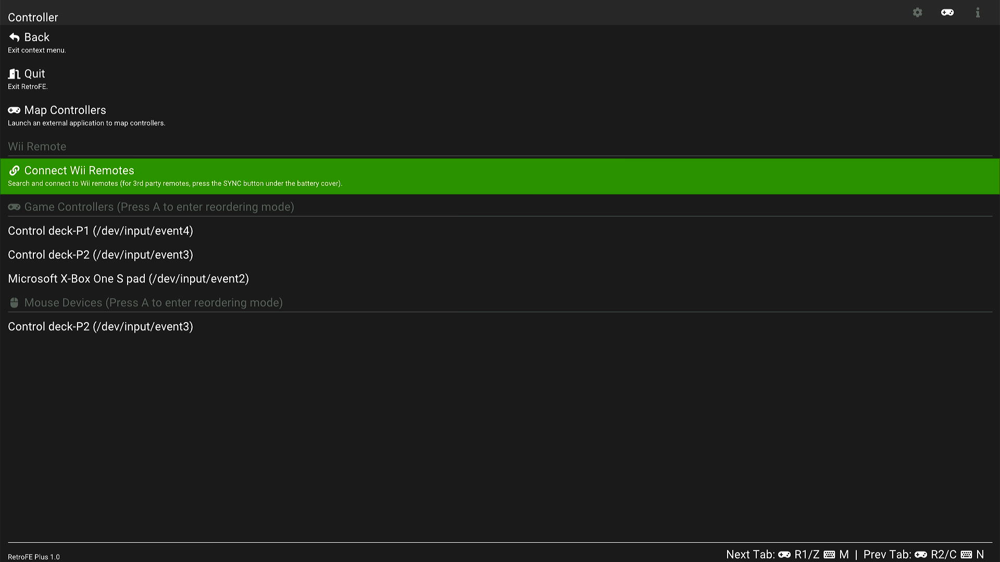
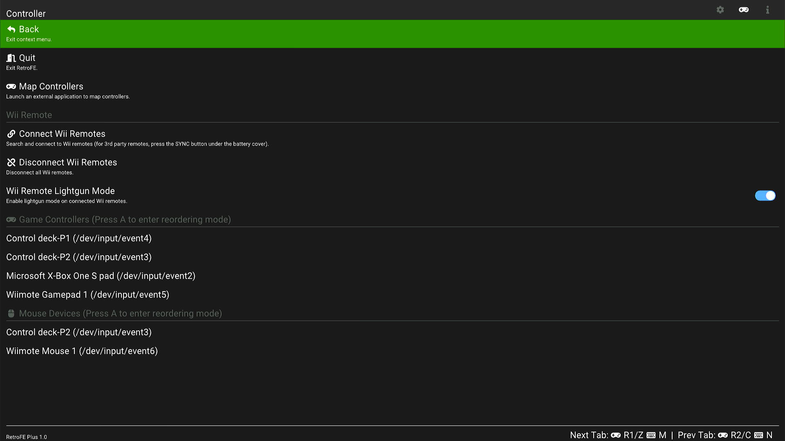
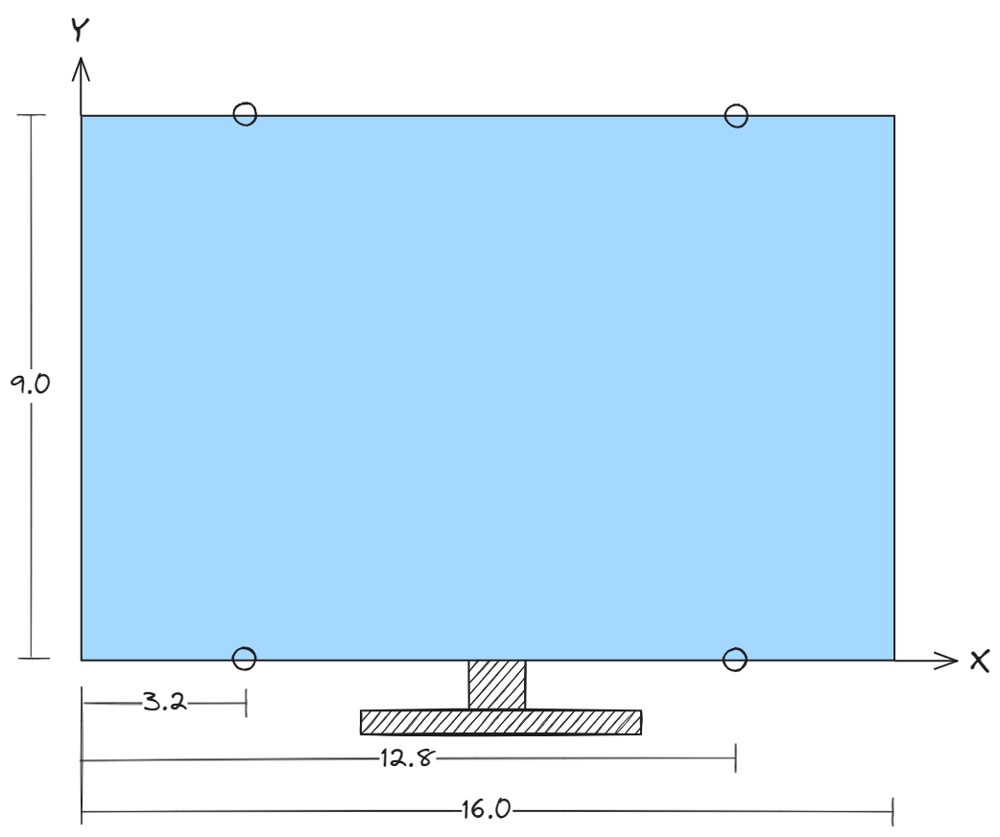
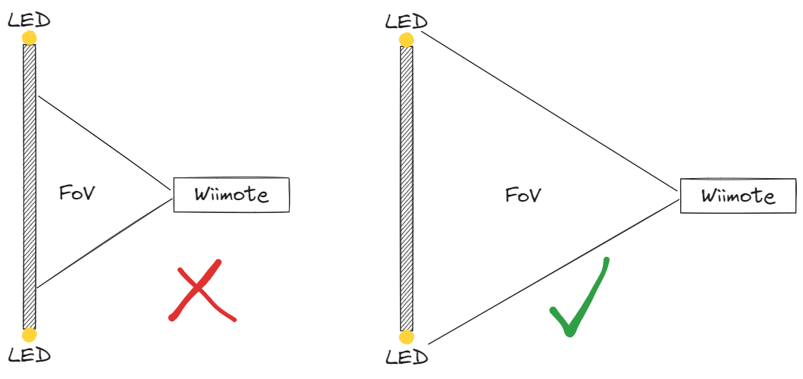

# Connecting a Wii remote
{: .no_toc }

## Table of contents
{: .no_toc .text-delta }

1. TOC
{:toc}

---

{: .note }
Please do ***not*** attempt to pair the Wii remote in the stock UI.
Doing so will only interfere with connecting it from RetroFE.
If you've already paired it in the stock UI, please remove the pairing before proceeding.

## Steps

1. Bring up the RetroFE context menu (by pressing the MENU button).
   Switch to the **Controller** tab (using Z/C buttons).
   There is a **Connect Wii Remotes** menu item on that tab.
   Do not press it yet.


1. On the Wii remote, press button 1 and 2 together to put it into Bluetooth connection mode.
   The LEDs on the Wii remote should start flashing.
   
   {: .note-title }
   > Note for third party Wii remotes
   >
   > It's been noticed that third party Wii remotes typically have a shorter time period staying in the BT connection mode,
   > which is not enough for the software to finish the handshake process.
   > If that's the case, try holding and do not let go buttons 1 and 2 during the connection process.
   > If that still doesn't work, try pressing the red button under the battery cover.

1. Within the RetroFE menu, press **Connect Wii Remotes**.
   Once the connection succeeds, the Wii remote will rumble once and one of the four LEDs on the Wii remote lights up to indicate the index of that remote.

   If the connection times out, try repeating steps 2 and 3.

# Using the Wii remote

The **Controller** menu will look like the following after having successfully connected a Wii remote:



## Explanation of menu items

### Wii Remote Lightgun Mode

- **On**:
  IR tracking data from the Wii remote camera is used as mouse cursor input.
  Button **A** acts as a mouse left click.
  Button **B** acts as a mouse right click.
  If a nunchuk is connected, button **Z** and **C** on the nunchuk act as mouse left/right clicks as well.

- **Off**:
  The orientation sensor data is used as mouse input.
  "Pitch" is used as mouse X input.
  "Roll" is used as mouse Y input.
  Buttons **A**, **B**, **Z**, and **C** act as normal game controller buttons.

### Game Controllers

This section lists all currently connected game controllers.

By default, when entering RetroArch, the first controller is assigned to player 1, the second controller is assigned to player 2, and so on.

To change the order, highlight a certain game controller, then press **A** to enter reordering mode,
where you can press **Up/Down** to change the position of the highlighted controller in the list.
When done reordering, press **A** again to exit the reordering mode.

The order of the controllers will persist until exiting RetroFE.

### Mouse Devices

This section lists all currently connected mouse devices (including lightguns, trackballs, spinners).

Reordering the list works the same way as for the **Game Controllers** list.

By default, when entering RetroArch, the first mouse is assigned to player 1, the second mouse is assigned to player 2, and so on.

This can be changed in the RetroArch menu, under **Settings->Input->RetroPad Bindings->Player 1/2/3/4 Controls->Mouse Index**.
So it is possible to let player 1 and player 2 both use the same mouse (some spinner games use the X axis of the mouse for player 1,
and Y axis for player 2).

## Setting up the IR LEDs for lightgun games

This setup requires four IR LED emitters placed around the monitor.
There's no hard requirement on exactly where to place them. You just need to specify their locations to the software.

Open `appdata/retrofe/settings.conf` in a text editor, find the line that looks like the following:
```ini
wiimote.sensorPositions = 16.0, 9.0, 3.2, 0, 12.8, 0, 3.2, 9.0, 12.8, 9.0
```
The numbers represent *Screen Width*, *Screen Height*, x<sub>1</sub>, y<sub>1</sub>, x<sub>2</sub>, y<sub>2</sub>, x<sub>3</sub>, y<sub>3</sub>, x<sub>4</sub>, y<sub>4</sub>,
where (x<sub>i</sub>, y<sub>i</sub>) is the Cartesian coordinate of the *i*th LED emitter.
The origin (0, 0) is at the lower-left corner of the monitor.
Positive X points rightward.
Positive Y points upward.
The unit can be anything (e.g., inch, cm, mm, or any arbitrary unit), as long as all numbers use the same unit.
The order of the four coordinates doesn't matter. They will be sorted internally.

So the above configuration line represents the following scenario:



## Other tips for lightgun games

- When using mame2003-plus, set the core option **Input->X-Y Device** to **Lightgun**.

## Troubleshooting

### Lightgun cursor has no response from Wii remote

- Make sure in the **Controllers** menu, **Wii remote lightgun mode** is toggled on.
- Make sure **Wiimote Mouse** is the first in the **Mouse Devices** list.
- Sometimes the Wii remote camera may fail to turn on. Try to disconnect and reconnect from the menu.

### Lightgun cursor "jitters" a lot

- Make sure the core option **Input/X-Y device** is set to **Lightgun** and not mouse.

### Lightgun cursor sometimes disappears

- The Wii remote's camera needs to see all 4 LED emitters from time to time,
  in order to perform automatic calibration. So try not to be too close to the monitor,
  as the camera has a relatively narrow field of view (FOV).

  

